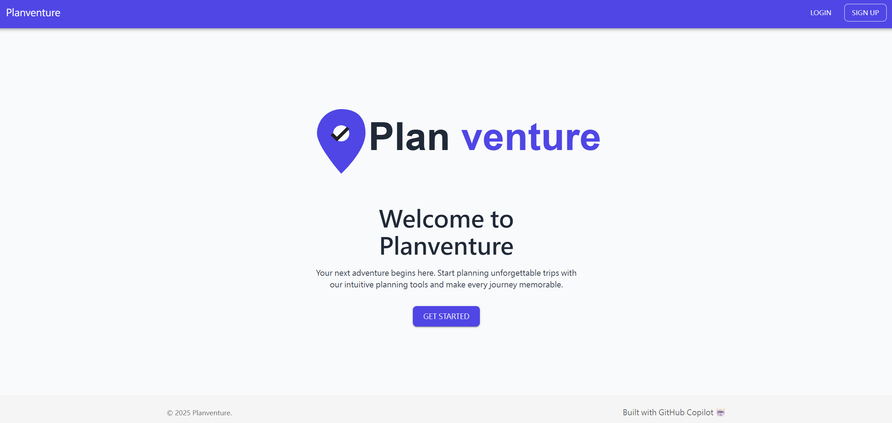
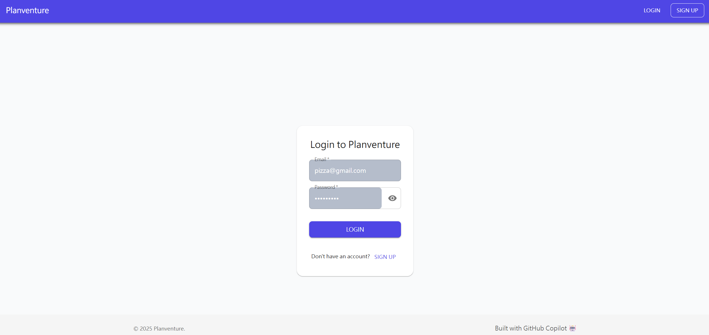
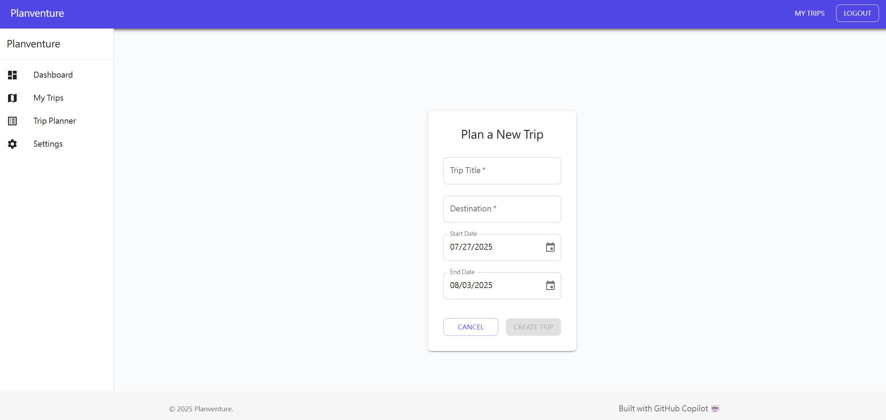

# Planventure 🚁

[](https://codespaces.new/github-samples/planventure)

> 旅程規劃平台 Planventure：結合 Flask REST API 與 React 前端的全端專案







---

## 目錄
- [專案架構圖](#專案架構圖)
- [安裝說明](#安裝說明)
- [快速入門](#快速入門)
- [前端專案說明](#前端專案說明)
- [API 文件](#api-文件)
- [License](#license)

---

## 專案架構圖

```text
planventure/
├── planventure-api/      # Flask REST API 後端
│   ├── app.py
│   ├── models/
│   ├── routes/
│   ├── utils/
│   └── ...
└── planventure-client/   # React 前端
    ├── src/
    ├── public/
    └── ...
```

---

## 安裝說明

### 後端 (Flask API)
1. 進入 `planventure-api` 目錄：
   ```sh
   cd planventure-api
   ```
2. 建立虛擬環境並啟用：
   ```sh
   python -m venv venv
   source venv/bin/activate  # Windows: venv\Scripts\activate
   ```
3. 安裝依賴：
   ```sh
   pip install -r requirements.txt
   ```
4. 複製環境變數檔：
   ```sh
   cp .sample.env .env
   ```
5. 啟動 Flask 伺服器：
   ```sh
   flask run
   ```

### 前端 (React Client)
1. 進入 `planventure-client` 目錄：
   ```sh
   cd planventure-client
   ```
2. 安裝依賴：
   ```sh
   npm install
   ```
3. 啟動前端開發伺服器：
   ```sh
   npm run dev
   ```

---

## 快速入門

1. 啟動後端 API (`localhost:5000`)
2. 啟動前端 (`localhost:5173`)
3. 開啟瀏覽器進入 [http://localhost:5173](http://localhost:5173) 開始使用

---

## 前端專案說明

- 使用 [React](https://react.dev/) + [Vite](https://vitejs.dev/) 建構
- 主要目錄：
  - `src/pages/`：主要頁面元件
  - `src/components/`：共用元件
  - `src/services/`：API 串接
  - `src/context/`：React Context 狀態管理
- 主要功能：
  - 使用者註冊/登入
  - 行程建立、編輯、檢視
  - 行程總覽、住宿、交通、每日規劃
  - 權限保護路由

---

## API 文件

- 後端 API 以 RESTful 設計，主要端點如下：

| Method | Endpoint           | 說明             |
|--------|--------------------|------------------|
| GET    | /                  | 歡迎訊息         |
| GET    | /health            | 健康檢查         |
| POST   | /auth/signup       | 使用者註冊       |
| POST   | /auth/login        | 使用者登入       |
| GET    | /trips             | 取得所有行程     |
| POST   | /trips             | 建立新行程       |
| GET    | /trips/<trip_id>   | 取得單一行程     |
| PUT    | /trips/<trip_id>   | 更新行程         |
| DELETE | /trips/<trip_id>   | 刪除行程         |

> 更多細節請參閱 [`planventure-api/TRIP_API_DOCS.md`](planventure-api/TRIP_API_DOCS.md)

> Swagger api文件 : http://localhost:5000/apidocs/


---

## License

本專案採用 MIT License，詳見 [LICENSE](LICENSE)